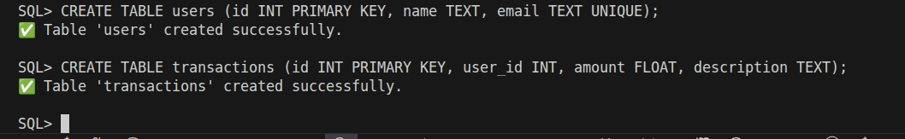
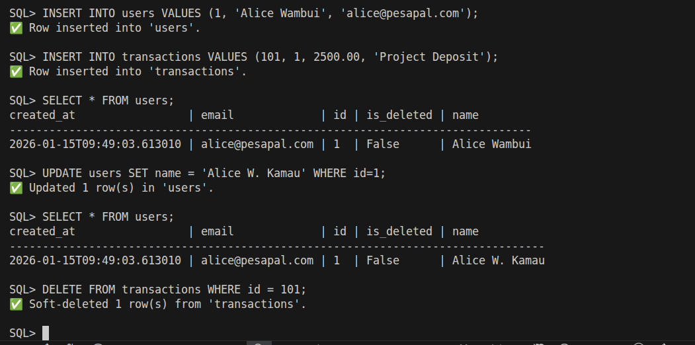
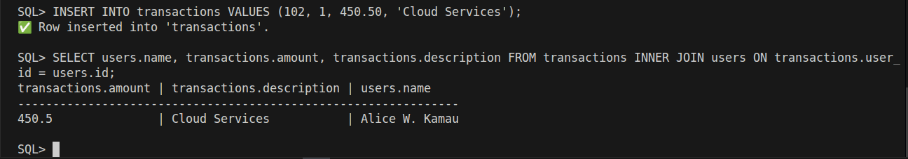
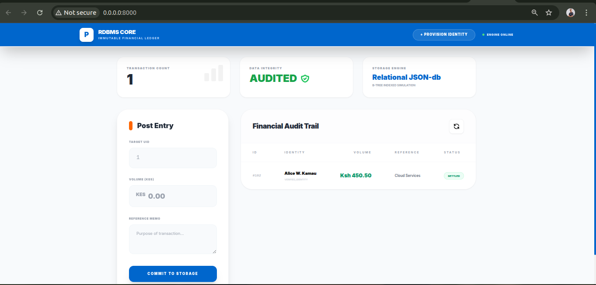
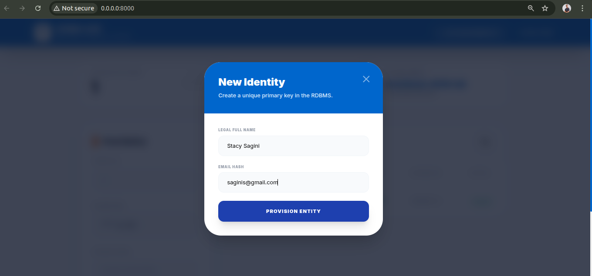
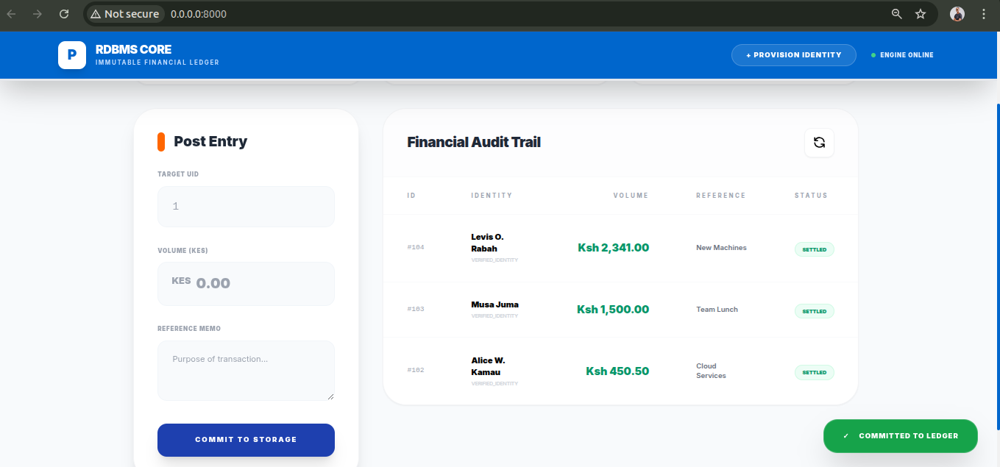

# 🏗️ Custom RDBMS & Financial Ledger System
### Pesapal Junior Dev Challenge 2026 Submission

## About This Project

This is my submission for the **Pesapal Junior Developer Challenge 2026**. The challenge asked for something ambitious: build a relational database management system (RDBMS) from scratch, support SQL queries, add indexing and constraints, implement joins, and demonstrate it with a working web application.

I took this as an opportunity to build something meaningful rather than just checking boxes. The result is a functional database engine written in Python (no external DB libraries), complete with an interactive SQL REPL and a real web application that uses it to manage user profiles and financial transactions.

## What I Built

### **Core RDBMS Engine**
The heart of this project is a relational database system that handles:
- **Table Creation & Schema Management** - Define tables with typed columns and constraints
- **CRUD Operations** - Full support for CREATE, READ, UPDATE, DELETE queries
- **SQL Querying** - Custom SQL parser that tokenizes and executes queries without external dependencies
- **Relational Joins** - INNER JOIN support with optimized hash-based algorithms
- **Primary & Unique Keys** - Constraint enforcement for data integrity
- **Basic Indexing** - O(1) lookups via hash-map indexes to keep queries fast
- **Persistence** - All data is stored as JSON files with atomic write guarantees

### **Interactive SQL REPL**
Want to test the database directly? Run `python3 main.py` and you'll get a command-line interface where you can:
- Execute SQL commands in real-time
- Create tables and define schemas
- Query and manipulate data interactively
- See results immediately

### **Web Application**
To prove the RDBMS actually works in a real scenario, I built a web app (FastAPI + HTML) that demonstrates:
- **User Management** - Create and manage user profiles
- **Transaction Ledger** - Record and view financial transactions
- **Live Relational Joins** - The transaction ledger uses database joins to connect users with their transactions
- **Clean UI** - Simple, functional interface for data exploration

## How It Works

The system is organized into clean, focused modules:

```
core/
├── engine.py       # The database engine - handles queries and joins
├── parser.py       # SQL parser - tokenizes and parses SQL statements  
├── indexing.py     # Index management - keeps lookups fast
└── storage.py      # Persistence layer - reads/writes JSON files

web_app/
├── app.py          # FastAPI application with endpoints
└── templates/
    └── index.html  # Web interface

main.py            # Interactive SQL REPL
test_api.py        # Tests to verify everything works
```

## 🛠️ Getting Started

### Prerequisites
- Python 3.8+
- Standard library only (no external DB libraries!)

### Installation & Usage

1. **Clone and prepare:**
   ```bash
   cd /home/levis/Desktop/PESAPAL/pesapal-jdev-challenge-2026
   python -m venv .venv
   source .venv/bin/activate
   pip install -r requirements.txt
   ```

2. **Interactive REPL Mode:**
   ```bash
   python3 main.py
   ```
   Then try commands like:
   ```sql
   CREATE TABLE users (id INT PRIMARY KEY, name VARCHAR);
   INSERT INTO users VALUES (1, 'Midusa');
   SELECT * FROM users;
   ```

3. **Run the Web App:**
   ```bash
   python web_app/app.py
   ```
   Then open your browser to `http://localhost:8000`

## 📸 System Evidence & CRUD Demonstration

### **Interactive SQL REPL**
Evidence of database functionality through direct SQL command execution:

| Feature | Screenshot | Purpose |
|---------|------------|---------|
| **Schema Definition** |  | Demonstrates table creation with typed columns and constraints |
| **Data Operations** |  | Shows CREATE, READ, UPDATE, DELETE operations in action |
| **Relational Queries** |  | Evidence of INNER JOIN support between multiple tables |
| **Constraint Enforcement** |  | Validates PRIMARY KEY and UNIQUE constraint integrity |

### **Web Application**
User-facing interface demonstrating real-world database usage:

| Feature | Screenshot | Purpose |
|---------|------------|---------|
| **UI Overview** |  | Main dashboard showing system capabilities |
| **Data Entry** |  | Form-based user and transaction creation interface |
| **Relational View** |  | Transaction ledger displaying JOINed user-transaction data |

---

## Key Design Decisions

### **Why from Scratch?**
The challenge explicitly said we'd be evaluated on how much we know and can do. Building everything from first principles meant:
- No hiding behind abstractions
- Clear responsibility for every operation
- Actual understanding of how databases work under the hood

### **Soft-Delete Pattern (Fintech-First)**
For financial data integrity, I implemented soft deletes - records are marked as deleted rather than erased. This design decision is critical for Pesapal-level compliance because:
- **Audit Trail Preservation** - All historical transactions remain accessible for regulatory review
- **Accidental Data Recovery** - Prevents irreversible loss of financial records
- **Compliance Ready** - Supports fintech audit requirements and regulatory standards (e.g., KYC, transaction history retention)
- **Forensic Analysis** - Enables investigation of suspicious activities by reviewing the complete timeline of record changes

This pattern is standard in banking and payment systems where data immutability is non-negotiable.

### **Index Optimization**
Joins can be slow (O(n²)), so I added hash-map indexing for key columns. This brings join performance down to O(n) - the difference between a system that works and one that doesn't.

### **JSON Storage**
Data is persisted as JSON files. While not as sophisticated as binary formats, it's:
- Human-readable for debugging
- Easy to understand and audit
- Sufficient for demonstrating the concept
- Portable across systems

## Learning & Growth

Ths project demonstrates:
- How relational databases actually work
- Writing parsers and interpreters
- Data structure optimization
- Building layered architectures
- Integration testing

## ✅ Testing

Run the included tests to verify everything works:
```bash
python3 test_api.py
python3 test.py
```

## Acknowledgments

This project uses only Python's standard library for the core RDBMS. The web framework and other dependencies are listed in `requirements.txt`. No external database engines were used in building the database system itself - that was the whole point of the challenge!

---

## AI Attribution & Methodology

**GitHub Copilot** was leveraged as a tool for debugging.

This represents a balanced approach where AI augmented non-critical paths while the core database engineering was developed through deep technical understanding.

---

**Author:** Levis Rabah  
**Submission Date:** January 15, 2026  
**Challenge:** Pesapal Junior Developer Challenge 2026
